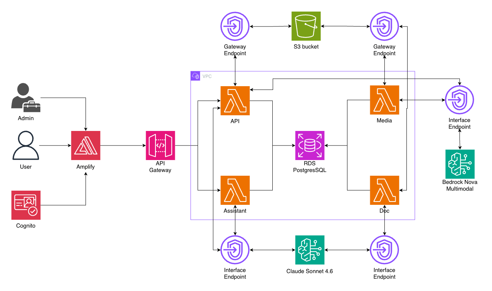

# PACP Platform Redesign

The Pan-American Ceramics Project (PACP) is an archaeological initiative building a collaborative platform for ceramic artifact data across the Americas, with an initial focus on the American Southwest. Ceramic data today is spread across CRM reports, museum collections, academic publications, theses, and private databases, in inconsistent formats that are hard to find, compare, and cite.

This repository holds the architecture design for the redesigned PACP platform, produced by the ASU Artificial Intelligence Cloud Innovation Center (AI CIC) powered by AWS. It describes a serverless AWS architecture that gives archaeologists, CRM professionals, and students structured records, fuzzy and faceted search, image-based sherd identification, version history, human review, AI-assisted document extraction, and a plain-language assistant, at a cost suited to a proof of concept.

## Disclaimers

Customers are responsible for making their own independent assessment of the information in this document. This document:

(a) is for informational purposes only,

(b) references AWS product offerings and practices, which are subject to change without notice,

(c) does not create any commitments or assurances from AWS and its affiliates, suppliers or licensors. AWS products or services are provided "as is" without warranties, representations, or conditions of any kind, whether express or implied. The responsibilities and liabilities of AWS to its customers are controlled by AWS agreements, and this document is not part of, nor does it modify, any agreement between AWS and its customers, and

(d) is not to be considered a recommendation or viewpoint of AWS.

Additionally, you are solely responsible for testing, security and optimizing all code and assets on GitHub repo, and all such code and assets should be considered:

(a) as-is and without warranties or representations of any kind,

(b) not suitable for production environments, or on production or other critical data, and

(c) to include shortcuts in order to support rapid prototyping such as, but not limited to, relaxed authentication and authorization and a lack of strict adherence to security best practices.

All work produced is open source. More information can be found in the GitHub repo.

---


## Table of Contents


| Document                                                 | Description                                                                       |
| -------------------------------------------------------- | --------------------------------------------------------------------------------- |
| [High Level Architecture](#high-level-architecture)      | Overview of the system and how its parts work together                            |
| [Architecture Deep Dive](./docs/architectureDeepDive.md) | Each component, networking and access, data model, and the key design decisions   |
| [User Flows](./docs/userFlow.md)                         | The user stories the platform supports and how the architecture delivers each one |
| [Cost Estimation](./docs/costEstimation.md)              | Assumptions, monthly and one-time costs, and where cost can move                  |
| [Project Closure](./docs/projectClosure.md)              | Engagement summary and recommendations                                            |
| [Credits](#credits)                                      | Contributors and acknowledgments                                                  |
| [License](#license)                                      | License information                                                               |


---


## High Level Architecture



Users open the PACP web application, hosted on AWS Amplify, and sign in through Amazon Cognito. Every action goes to Amazon API Gateway, which checks the user's identity and passes the request to one of two AWS Lambda functions: `API` for all normal operations, or `Assistant` for the chat feature. Both read and write a single Amazon RDS for PostgreSQL database, which also holds image fingerprints (pgvector) and handles fuzzy matching (pg_trgm).

Files live in one Amazon S3 bucket. When an image or document lands in the bucket, S3 starts a background Lambda function: `Media` creates web-size copies and image fingerprints, `Doc` turns PDFs and CSVs into draft records. AI features run on Amazon Bedrock, using Amazon Nova Multimodal Embeddings for image fingerprints and Anthropic Claude Sonnet 4.6 for language tasks. Users never reach S3, the database, or Bedrock directly; every path goes through a Lambda function, and every AI output is reviewed by a person before it is published.

For the full explanation and the decisions behind it, see the [Architecture Deep Dive](./docs/architectureDeepDive.md).

---


## Repository Contents

```
├── docs/
│   ├── architectureDeepDive.md
│   ├── userFlow.md
│   ├── costEstimation.md
│   ├── projectClosure.md
│   └── media/
│       └── architecture.png
├── backend/        CDK project scaffold (TypeScript)
├── frontend/       Next.js application scaffold
├── LICENSE
└── README.md
```

The `backend/` and `frontend/` folders contain the starting scaffolds for the CDK infrastructure and the Next.js application described in the architecture. They are provided as a base for implementation.

---


## Credits

This architecture was developed by the ASU Artificial Intelligence Cloud Innovation Center (AI CIC) powered by AWS, in collaboration with the Pan-American Ceramics Project team.

- [Contributor name](LinkedIn URL)
- [Contributor name](LinkedIn URL)

---


## License

This project is licensed under the MIT License - see the [LICENSE](./LICENSE) file for details.